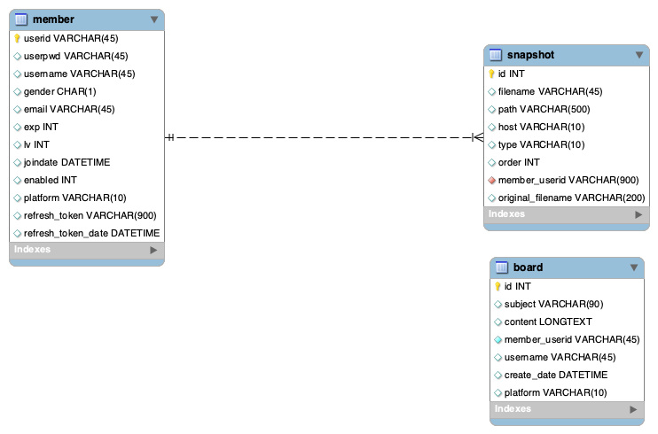
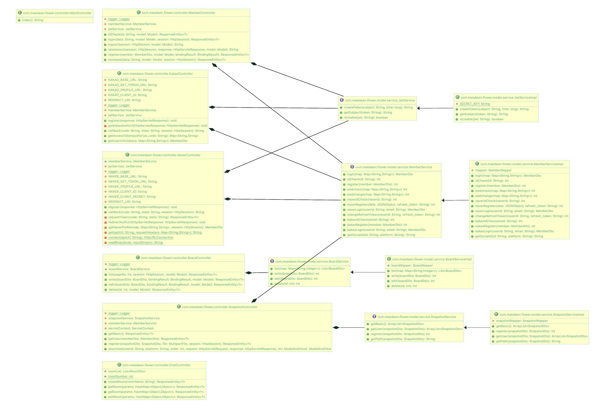
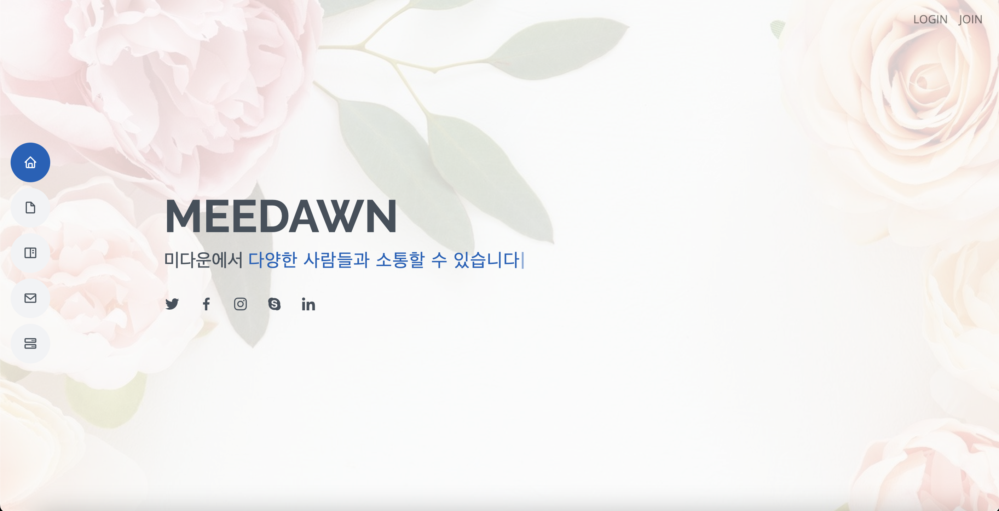
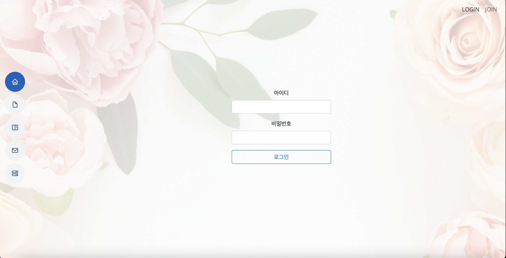
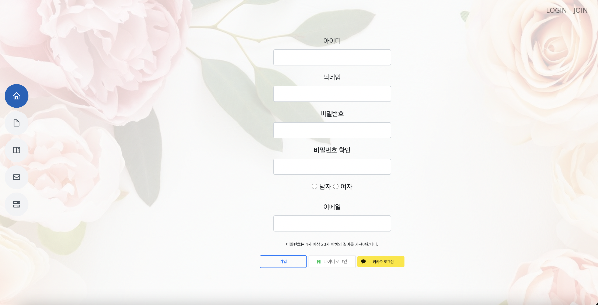
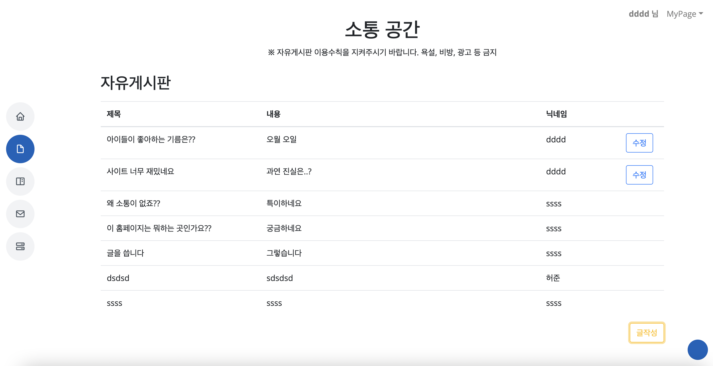
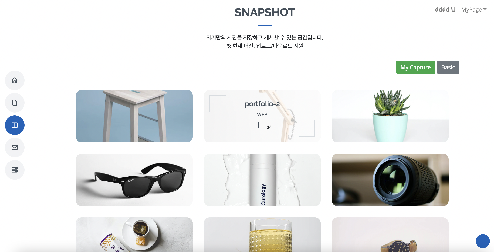
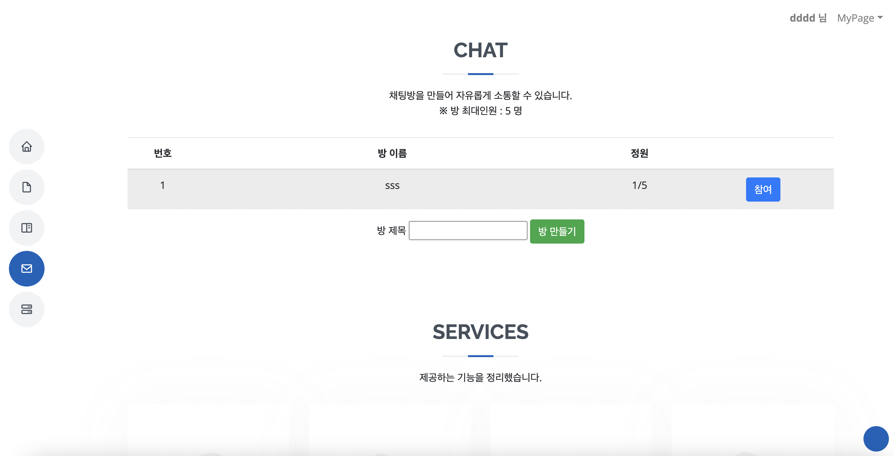
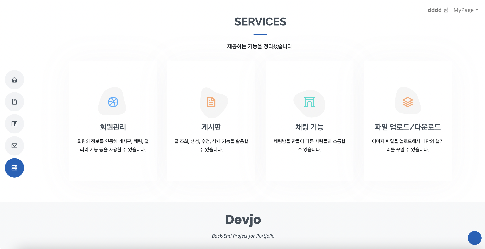

# MEEDAWN(커뮤니티 사이트)

## 1. 웹사이트 제작

* 커뮤니티 사이트의 기능을 구현한 웹사이트를 제작했습니다.

​                  

## 2. 요구사항 정의서

| **순번**                | **요구사항명** | **요구사항  상세**                                 |
| ----------------------- | -------------- | -------------------------------------------------- |
| **기능적 요구사항**     |                |                                                    |
| A01                     | 회원 관리      | 회원정보 가입, 조회, 수정, 삭제                    |
| A02                     | 로그인 관리    | 로그인, 로그아웃                                   |
| A03                     | 소셜 로그인    | 네이버, 카카오 연동 회원가입 및 로그인             |
| B01                     | 게시판 기능    | 게시판 글 조회, 등록, 수정, 삭제                   |
| C01                     | 채팅방 기능    | 채팅방 조회, 생성, 참여, 삭제                      |
| D01                     | 갤러리 기능    | 기본 갤러리 제공, 이미지 업로드, 다운로드          |
| **비  기능적 요구사항** |                |                                                    |
| NF1                     | 가용성         | 언제나 서비스 가능해야 함                          |
| NF2                     | 응답성         | 검색에 대한 결과를 빠르게 응답해야 함              |
| NF3                     | 사용자 편의성  | 사전 지식이 없어도 쓰기 편해야 함                  |
| NF4                     | 가독성         | 사용자가 UI를 한눈에 이해하고 쓸 수 있도록 해야 함 |

​               

## 3. 테이블 구조도(ERD)

​                  

## 4. 클래스 다이어그램

​                                

## 5. 화면 설계서

​               

 ### 1) 메인 화면

​                                  

### 2) 회원가입/로그인

​              

### 3) 게시판

​             

### 4) 갤러리 기능

​                

### 5) 채팅방 기능

​                         

### 6) 사이트 소개

